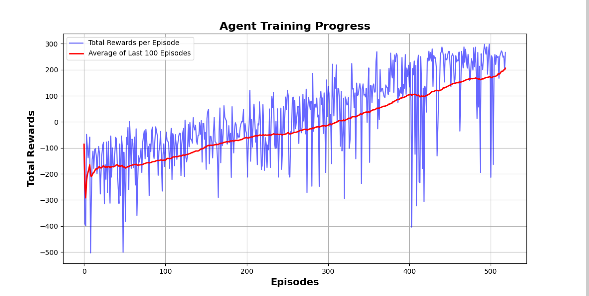

# Lunar_Landing
# Lunar Lander Project Using Double Deep Q Networks

This project utilizes the Double Deep Q Networks (DDQN) to train an agent that can safely land a lunar lander on a designated landing pad on the moon's surface.

## Environment Description

**OpenAI's Gym Library** has transitioned to **Gymnasium** by Farama Foundation. All future development will continue under Gymnasium. For more details, visit [Gymnasium's environments](https://www.gymlibrary.dev/environments/box2d/index.html).

### Lunar Lander Environment

The goal in the Lunar Lander environment is to land the module on a landing pad marked by two flag poles at coordinates (0,0). The module starts at the top center of the environment with a random initial force applied. The challenge is considered solved if the agent achieves an average of 200 points over the last 100 episodes.

#### Action Space

The agent can perform one of four discrete actions:
- **0**: Do nothing.
- **1**: Fire right engine.
- **2**: Fire main engine.
- **3**: Fire left engine.

#### Observation Space

The state is represented by an 8-dimensional vector:
- Coordinates (x, y)
- Linear velocities (x, y)
- Lander angle and angular velocity
- Booleans for each leg's contact with the ground

#### Rewards

- Landing on the pad: 100-140 points.
- Moving away from the pad: penalty.
- Crashing: -100 points.
- Resting: +100 points.
- Leg contact: +10 points per leg.
- Main engine use: -0.3 points per frame.
- Side engine use: -0.03 points per frame.

#### Episode Termination

The episode ends if:
- The lander crashes.
- The x-coordinate exceeds ±1.

## Double Deep Q Networks (DDQN)

Traditional DQNs often overestimate action values, leading to suboptimal policies. DDQN reduces this by using separate networks for action selection (`q_network`) and evaluation (`target_q_network`), enhancing stability and accuracy in learning.

## Result Representation

Below is a visualization of how the agent's performance improved over training sessions.

### Training Progress Graph

### Simulation Video

Here is a video demonstrating the agent using trained `q_network` in the Lunar Lander environment. Note that each session starts with a different initial force, so outcomes may vary.

https://github.com/xiaorui0409/Lunar_Landing/assets/151507129/1aaf0084-d836-4c52-8ad4-7c2c4e7bdc3f

